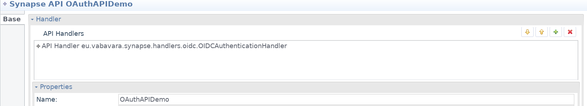

# OpenID Connect Handler for Apache Synapse

This project aims to provide a handler that would give Apache Synapse endpoints OIDC support. It is set up as a Maven project - just use `mvn package` or `mvn install` to build a jar or install it to your local Maven repository.

## Installation with WSO2

Just copy the jar and jose4j jar (see [#Dependencies]) into WSO2 lib folder.

## Usage with WSO2 EI

1. Add the reference to the Handler in the handlers section of your REST API definition.
    
2. Add properties to configure the behaviour of the handler (if missing, these values will be pickeb up from globaal WSO2 configuration):
    * keywsUris - URIs of the keyws page of your auhtentication provider. This URI is usually published in `\[Issuer URL\]/.well-known/openid-configuration` resource.
    * trustedOauth2Issuers - Issuer that is trusted.
    * expectedAudience - Expected value for audience of the claim. This is optional.
    
    ```xml
    <!-- Example of configuration with Azure AD. -->
    <handlers>
        <handler class="eu.vabavara.synapse.handlers.oidc.OIDCAuthenticationHandler">
            <property name="keywsUris" value="https://login.windows.net/common/discovery/keys"/>
            <property name="trustedOauth2Issuers" value="https://sts.windows.net/{tenantid}/"/>
            <property name="expectedAudience" value="https://{appurl}"/>
        </handler>
    </handlers>
    ```
3. The handler will respond with HTTP 401 Unauthorized in case the token validaion fails. It is up to the application to authorize the user further. The following properties will be pushed to Axis2 scope for this purpose:
    * claim_appid - appid claim (if present).
    * claim_scope - scope claim if present.
    * claim_sub - sub claim if present.
    * claim_aud - aud claim if present.
    * claim_jwt - original JWT token (this can, if necessary, be passed through).
    ```xml
    <!-- Example of payload factory to extract all pushed Axis2 properties. -->
    <payloadFactory media-type="json">
        <format>{
        "appid": "$1",
        "scope": "$2",
        "sub": "$3",
        "jwt": "$4",
        "aud": "$5"
    }</format>
        <args>
            <arg evaluator="xml" expression="$axis2:claim_appid"/>
            <arg evaluator="xml" expression="$axis2:claim_scope"/>
            <arg evaluator="xml" expression="$axis2:claim_sub"/>
            <arg evaluator="xml" expression="$axis2:claim_jwt"/>
            <arg evaluator="xml" expression="$axis2:claim_aud"/>
        </args>
    </payloadFactory>
    ```

## Dependencies

This project uses reference implementation of OpenID Connect: [https://bitbucket.org/b_c/jose4j/src/master/].
    
## Usage terms

You are free to use this component as long as you refer to this project.
